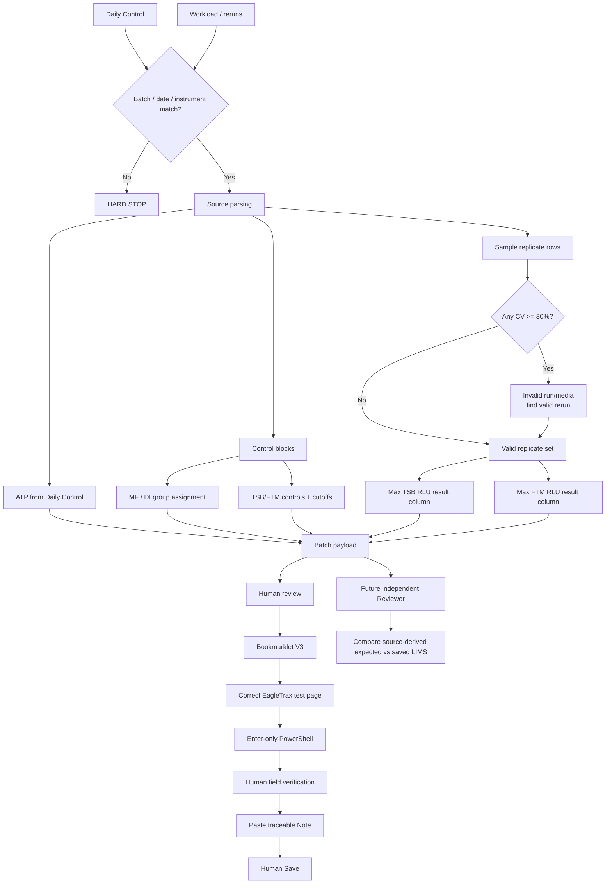

# Concept Map



## Separation of responsibility

```text
AI / parser        → understand source + exceptions
Rules engine       → deterministic selection
Bookmarklet        → navigation only
PowerShell         → field prefill only
Human operator     → verify + Save
Reviewer           → independent compare + sign
```
